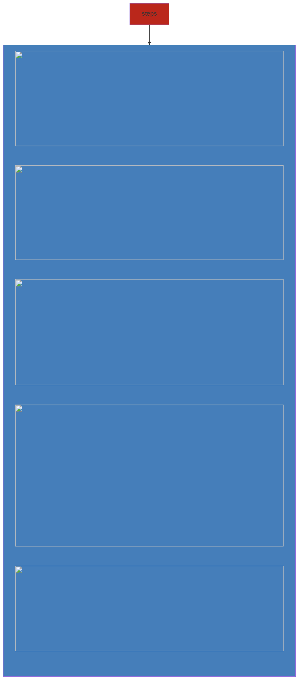

Connect records without having to create a relationship between two entities

Define **Connection roles** like
- Decision Maker
- Colleague
- Delivery Professional

##### Advantage over Relationships
Relationship only tells account and contact are related, not how they are related (like connection role)

### Configuring Connection

##### Creating a connection role

```mermaid

graph TB

0["steps"] --> 1
1["<div class = 'scrollmenu'><img src='./md_assets/attachments/dc5ba6ee-543a-4832-a27f-1d941c82278a.png' width='530' height='377'/><br><br><img src='./md_assets/attachments/3b38866e-ab0d-4754-b4a5-20007edacf11.png' width='306' height='376'/><br><br></div>"]
1 --> 2["<img src='./md_assets/attachments/Pasted%20image%2020221223101148.png' width='471' height='151'/>"]
2 --> 3["<div class = 'scrollmenu'><img src='./md_assets/attachments/1864e109-a4f9-4091-8914-c98cde6c36ab.png' width='471' height='151'/><br><br><img src='./md_assets/attachments/6ec7f252-ab97-4255-a04e-12c1159a9854.png' width='669' height='236'/><br><br><img src='./md_assets/attachments/237c8c82-10dd-4672-826f-85437e3fef30.png' width='669' height='272'/><br><br><img src='./md_assets/attachments/e3e468ed-b2c0-4c87-9bde-a541e518931c.png' width='665' height='332'/><br><br><img src='./md_assets/attachments/e5340fc0-c3a6-443c-a8e0-103c4858766b.png' width='478' height='197'/><br><br><img src='./md_assets/attachments/cf2bddb2-6817-41a1-96f4-e6bbb3f65621.png' width='586' height='374'/><br><br><img src='./md_assets/attachments/c239ba5d-5d19-404a-8917-1537053de011.png' width='503' height='374'/><br><br><img src='./md_assets/attachments/d9b8db1a-2b49-4694-af21-caf2a8ce65b1.png' width='578' height='374'/><br><br><img src='./md_assets/attachments/8fddbbf0-3008-452b-9ce6-02b5f660d25c.png' width='671' height='257'/><br><br><img src='./md_assets/attachments/84f90685-b712-41e6-92c7-93bffe1823d2.png' width='403' height='161'/><br><br><img src='./md_assets/attachments/a79f1de7-f42e-4591-b1f9-bf7900eb1bd9.png' width='525' height='374'/><br><br><img src='./md_assets/attachments/b4497d3a-8391-4d83-81a6-a770eecb1453.png' width='542' height='375'/><br><br><img src='./md_assets/attachments/be8e53d2-476a-4e04-b400-fcb2e7a27642.png' width='557' height='377'/><br><br></div>"]

style 0 fill:#ba271b
style 1 fill:#457eba
style 2 fill:#434483
style 3 fill:#434483

```

