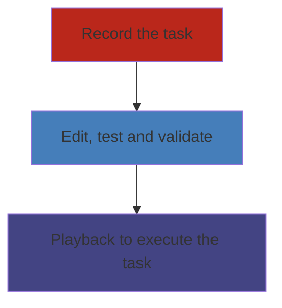

Makes use of a desktop app

### Steps

```mermaid

graph TB

0["Record the task"] --> 1
1["Edit, test and validate"]
1 --> 2["Playback to execute the task"]

style 0 fill:#ba271b
style 1 fill:#457eba
style 2 fill:#434483

```
