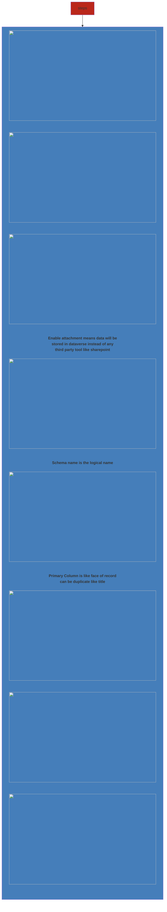
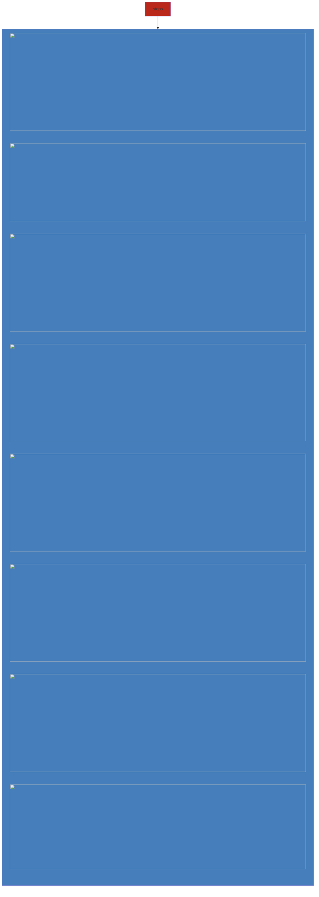

### Types
- **Standard Tables** - are the tables created by Microsoft power platform
- **Custom Tables** - are the tables created by users for creating business solution

### Data types
- **Single/Multiple line of text**
- **Currency**
- **Option set** - entity level
- **Global option set** - picklist for country

### Terms
- **Editable Grids** - Edit records inline in table

### Creating a custom entity

### Configuring Entity

