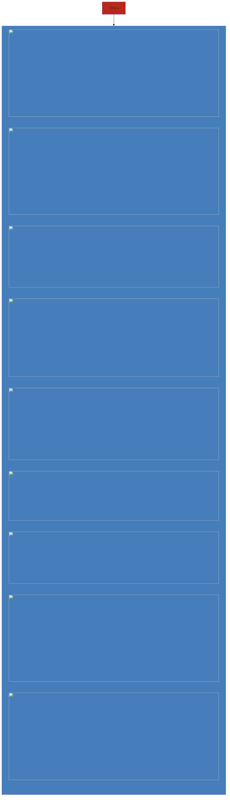

Hold applications and associated resources into one restricted domain

### Types
- **TriaI**
- **Sandbox** - development
- **Production** - live

##### Example

### Components
- region
- currency

### Creating new environment

