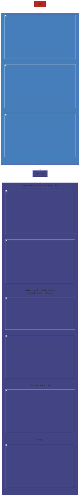

Creating end-to-end complex solution involving multiple teams, roles, and processes

### Creating a Model-Driven app

```mermaid

graph TB

0["steps"] --> 1
1["<div class = 'scrollmenu'><img src='./md_assets/attachments/57994846-a171-4587-ab49-cd2c89b6ba36.png' width='438' height='377'/><br><br><img src='./md_assets/attachments/3079a155-58ae-4fae-9aae-fff6f5d0c3bf.png' width='614' height='376'/><br><br><img src='./md_assets/attachments/a30bec0b-c5d5-4f6f-a6d2-d64e3b569dea.png' width='475' height='373'/><br><br></div>"]
1 --> 2["Add page"]
2 --> 3["<div class = 'scrollmenu'><b>page consists of particular Entity/Table</b><br><br><img src='./md_assets/attachments/f3f46455-42bc-48d7-9eb5-9f5111686426.png' width='380' height='376'/><br><br><img src='./md_assets/attachments/3eaa87ad-aeeb-4c02-af59-5afe90491895.png' width='599' height='376'/><br><br><b>application will fetch all the tables<br>from dataverse environment</b><br><br><img src='./md_assets/attachments/32dd55f4-d534-42dc-8b59-c905deb805af.png' width='493' height='277'/><br><br><img src='./md_assets/attachments/442ffe2b-62c1-411a-9128-c453cbcf2872.png' width='487' height='369'/><br><br><b>shows new app preview</b><br><br><img src='./md_assets/attachments/ddc27751-cf1b-4286-a120-69acef916929.png' width='462' height='374'/><br><br><b>sitemap</b><br><br><img src='./md_assets/attachments/Pasted%20image%2020221222211827.png' width='310' height='375'/><br><br></div>"]

style 0 fill:#ba271b
style 1 fill:#457eba
style 2 fill:#434483
style 3 fill:#434483

```

##### Adding Attributes

```mermaid

graph TB

0["Adding Attributes"] --> 1
1["<div class = 'scrollmenu'><img src='./md_assets/attachments/6cafc538-892b-451e-ba82-dc406ba44392.png' width='590' height='165'/><br><br><img src='./md_assets/attachments/66f6649c-c9e1-45c9-b002-d916c31b5b75.png' width='437' height='375'/><br><br><img src='./md_assets/attachments/c7d675f7-34c7-4d5a-9dc2-e46e4c6cb552.png' width='569' height='375'/><br><br><img src='./md_assets/attachments/95cf3181-7331-42e0-ac33-7d86508b45e6.png' width='521' height='376'/><br><br><img src='./md_assets/attachments/b30ba3be-4e1d-4721-808e-b638ae0d0596.png' width='485' height='375'/><br><br><img src='./md_assets/attachments/0cf14d2b-d8ae-4aca-a994-86ef061406ef.png' width='198' height='377'/><br><br></div>"]
0["Adding Attributes"] --> 2
2["Status and Status Reason"]
2 --> 3["Relation"]
3 --> 4["<img src='./md_assets/attachments/f73ff629-27c5-40e1-a960-782caa28abef.png' width='454' height='246'/>"]
2 --> 5["steps"]
5 --> 6["<div class = 'scrollmenu'><img src='./md_assets/attachments/734f2111-6bc2-4011-a4e9-3d1dbb183b27.png' width='452' height='376'/><br><br><img src='./md_assets/attachments/93b18d25-9ecf-4087-9ed0-b4f80e71342a.png' width='265' height='375'/><br><br><img src='./md_assets/attachments/9dcd3261-24ff-46b4-80f8-8dff970a64e5.png' width='151' height='377'/><br><br><img src='./md_assets/attachments/69e62e8e-ab88-413d-9e17-7882425aceb8.png' width='503' height='299'/><br><br><img src='./md_assets/attachments/a25e1ee4-a0f7-4934-acc5-4bbae537cca5.png' width='222' height='375'/><br><br><b>visit old UI if needed</b><br><br><p><img src='./md_assets/attachments/86204bf2-8fd8-422d-ae15-c04622b13039.png' width='518' height='324'/></p><br><br><img src='./md_assets/attachments/86f59309-52be-4661-8a27-521bf176ccdb.png' width='571' height='293'/><br><br><img src='./md_assets/attachments/4dfb363b-98bf-4838-a2a3-b6814ec3d0c5.png' width='482' height='376'/><br><br><img src='./md_assets/attachments/a7fcc394-7ab4-40bf-9701-d7d6842c2c10.png' width='507' height='377'/><br><br><img src='./md_assets/attachments/f23b098f-b933-43b3-aaf7-dca9ea0b90e0.png' width='667' height='192'/><br><br><img src='./md_assets/attachments/8c765ebc-e31d-4045-a4cd-67c39336ba71.png' width='358' height='374'/><br><br><img src='./md_assets/attachments/80b5fd4b-61db-4744-b348-f3d994c5f6e6.png' width='433' height='377'/><br><br><img src='./md_assets/attachments/bc72c750-fb14-42f2-9804-154fc2129b95.png' width='669' height='231'/><br><br><img src='./md_assets/attachments/9cce6b7d-fc0b-4b68-afb8-16cdae3492bd.png' width='667' height='238'/><br><br><img src='./md_assets/attachments/75c91541-c17e-41b4-b4c1-7ca9c9566677.png' width='621' height='374'/><br><br><b>Add them to form</b><br><br><img src='./md_assets/attachments/f0f77d25-f85c-4974-8b92-281ff366bec9.png' width='501' height='374'/><br><br><p><img src='./md_assets/attachments/c47f3bd7-1ff3-4831-96b6-a3d243beca33.png' width='579' height='374'/></p><br><br><img src='./md_assets/attachments/0ff21fd8-8e0d-4b0f-8e87-6f32e6c59acc.png' width='581' height='374'/><br><br><img src='./md_assets/attachments/545e7bdd-b898-4c7a-93b9-8af557680d14.png' width='572' height='374'/><br><br><img src='./md_assets/attachments/99c093ae-05c4-414f-9dce-10e62627075a.png' width='561' height='377'/><br><br><b>Save and Publish</b><br><br></div>"]

style 0 fill:#ba271b
style 1 fill:#457eba
style 2 fill:#457eba
style 3 fill:#434483
style 4 fill:#434483
style 5 fill:#434483
style 6 fill:#434483

```

##### Customize Form

```mermaid

graph TB

0["Customize Form"] --> 1
1["<div class = 'scrollmenu'><img src='./md_assets/attachments/53e24536-1467-4f58-b701-2b4fdb24ee9a.png' width='565' height='377'/><br><br><img src='./md_assets/attachments/9dc68bdc-b383-4c93-932d-c8f4e3846efd.png' width='671' height='296'/><br><br><img src='./md_assets/attachments/3df35bc3-0410-4428-91f6-e8336d3f0ceb.png' width='669' height='337'/><br><br><img src='./md_assets/attachments/b7df44e6-bd4c-43df-8669-e4a9d4e0426b.png' width='666' height='312'/><br><br><b>Main is the form getting displayed to<br>the user</b><br><br><img src='./md_assets/attachments/934d2287-22c2-4416-ba9e-ceb41c76ed22.png' width='571' height='376'/><br><br></div>"]
1 --> 2["Create another tab"]
2 --> 3["<div class = 'scrollmenu'><img src='./md_assets/attachments/00a63777-42bf-4238-80d1-36b6b6612607.png' width='395' height='376'/><br><br><img src='./md_assets/attachments/8011fd25-0f88-4180-ab0d-50555e0c730d.png' width='268' height='375'/><br><br><img src='./md_assets/attachments/cd5ee9de-9090-4b77-877a-3dfb2d595608.png' width='666' height='216'/><br><br><b>New tab is created with 2 sections inside</b><br><br><img src='./md_assets/attachments/a79488c0-9bc1-45a7-b2c6-316d3e58569f.png' width='601' height='375'/><br><br><img src='./md_assets/attachments/473f42db-2f23-4725-a667-56bbd5b58163.png' width='224' height='376'/><br><br><img src='./md_assets/attachments/19ac4efa-548d-458e-a6d6-a5150fbebaaa.png' width='585' height='376'/><br><br><img src='./md_assets/attachments/11697500-598e-4073-802d-3b12b80b8c1d.png' width='669' height='341'/><br><br></div>"]
3 --> 4["<img src='./md_assets/attachments/fed65983-e320-4a51-a0d7-1764f571bfda.png' width='669' height='238'/>"]
4 --> 5["The read only field cannot be edited"]
3 --> 6["<img src='./md_assets/attachments/8e027bb6-528c-4522-8dd9-f7cff1f779ed.png' width='667' height='235'/>"]
6 --> 7["Lock field prevents other developers from<br>removing the field from the form."]

style 0 fill:#ba271b
style 1 fill:#457eba
style 2 fill:#434483
style 3 fill:#434483
style 4 fill:#434483
style 5 fill:#434483
style 6 fill:#434483
style 7 fill:#434483

```
