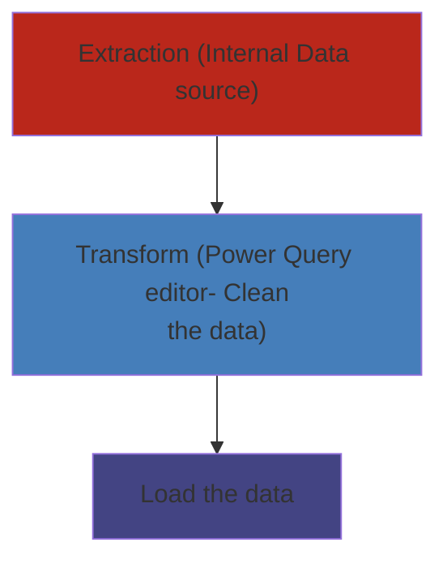

Analyse data and create Reports/Dashboards

### Types
- **Power BI desktop** - free
- **Power BI service** - premium

##### Difference between Power BI app and service
Dashboard can be created only in power BI service

### ETL
