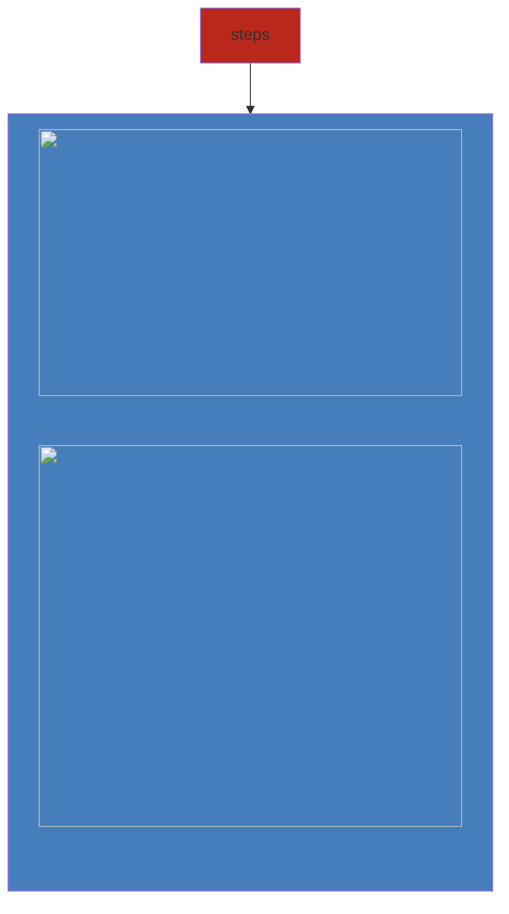

Optimized for creating new records quickly

### Configuring Quick Create form

```mermaid

graph TB

0["steps"] --> 1["<div class = 'scrollmenu'><img src='./md_assets/attachments/Pasted%20image%2020221224110226.png' width='417' height='263'/><br><br><img src='./md_assets/attachments/Pasted%20image%2020221224110006.png' width='279' height='376'/><br><br></div>"]

style 0 fill:#ba271b
style 1 fill:#457eba

```

