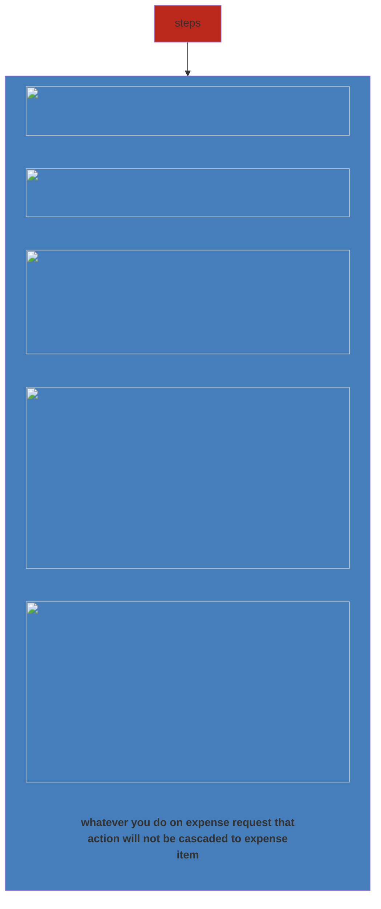

Configure what happens to its related records, when an action (delete or change of owner) is performed on the primary (parent) record

### Types
- **Referential** - no Cascading at all
- **Parental** - Cascading all
- **Custom** - specifically configure Delete, Share (with user/team) and Reparent operation

##### Custom options
**Cascade Active** - Perform the action on all active related entity records
**Cascade All** - Perform the action on all related entity records
**Cascade None** - Do nothing Like Referential
**Remove Link** - Remove the lookup value for all related records
**Restrict** - Prevent the primary entity record from being deleted when related entity records exist
**Cascade User Owned** - Perform the action on all related entity records owned by the same user as the primary entity record

### Example
- When you delete Expense Request record what should happen to all related Expense Item records
- When you assign (change of owner) Expense Request to your colleague, what should happen to all related Expense Item records

### Configuring Relationship Behaviour

