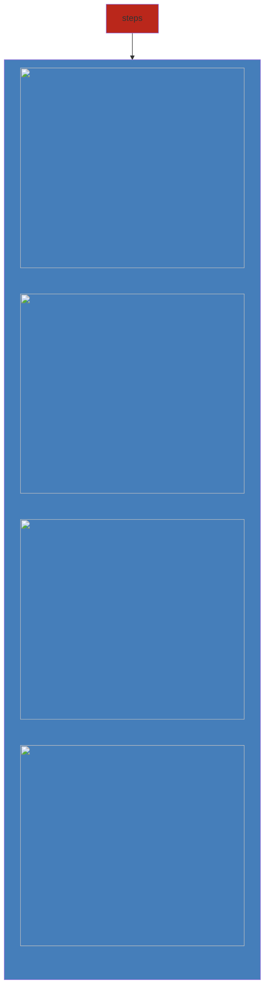

Allows a related entity record (N) to auto-populate data from primary record (1)

### Conditions
- entities must have relationship
- Mapping can only be done on 1:N or N:1 relationship

### Configuring Relationship Mapping
##### Account - contact

##### Define custom relationship mapping

```mermaid

graph TB

0["steps"] --> 1["<div class = 'scrollmenu'><b></b><br><br><img src='http://127.0.0.1:8000/507853c1-4f2e-41c3-bc16-db6c78c9e6f7.png' width='671' height='371'/><br><br><img src='http://127.0.0.1:8000/faca6e02-fde2-4a7f-94bc-a0229c982853.png' width='396' height='376'/><br><br><img src='http://127.0.0.1:8000/10657185-505d-4dd2-80f5-d3a0f7cb69cb.png' width='600' height='377'/><br><br><b>auto-populate Title of Expense Request<br>Entity to Title of Expense Item</b><br><br><img src='http://127.0.0.1:8000/6e444830-bd92-41d8-b3c7-1f259be64a58.png' width='668' height='376'/><br><br><img src='http://127.0.0.1:8000/a2c55f2e-ac0f-484a-b023-a4decadcdcb3.png' width='668' height='267'/><br><br><img src='http://127.0.0.1:8000/8bcf0e74-e560-4915-9565-b77e2f8981d7.png' width='630' height='375'/><br><br><b>data type should match</b><br><br><img src='http://127.0.0.1:8000/7b42aa54-1d3e-43dd-834e-2b4dad7f9a05.png' width='609' height='126'/><br><br><b>the length of their target field should<br>be greater than the source field</b><br><br><img src='http://127.0.0.1:8000/f25f79bd-2291-457d-8776-812f508f6321.png' width='668' height='359'/><br><br><img src='http://127.0.0.1:8000/8741fb3f-169f-412c-9595-cedc068fd25a.png' width='539' height='377'/><br><br><b>Test it</b><br><br><img src='http://127.0.0.1:8000/28a63320-c44c-4f60-a979-2f9f8720a8ae.png' width='670' height='265'/><br><br><img src='http://127.0.0.1:8000/72ca2b67-30cb-4768-bc0c-0a20791c51c7.png' width='372' height='376'/><br><br><img src='http://127.0.0.1:8000/b22fae2b-1e1c-4ce3-867b-c99d76fbbe3b.png' width='377' height='376'/><br><br></div>"]

style 0 fill:#ba271b
style 1 fill:#457eba

```
