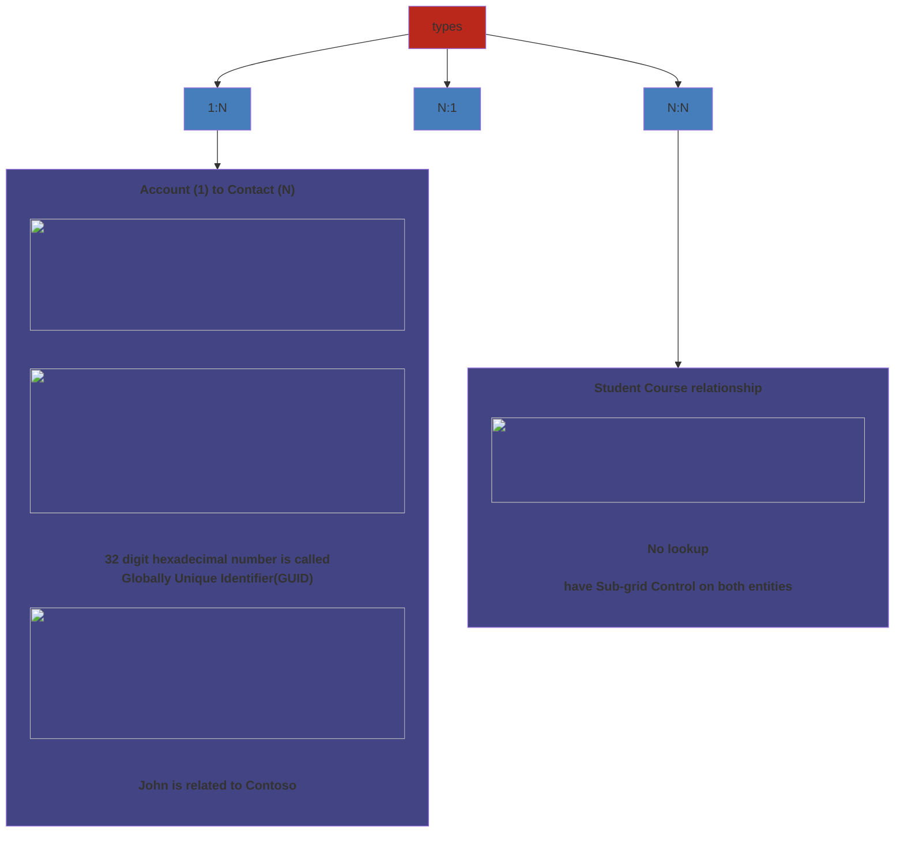
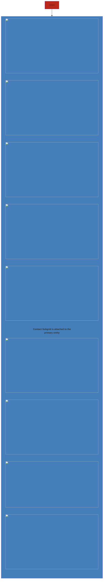

Define how records can be related to each other in the database

### Types

- **Sub-grid Control** - Allows you visualize all the related records from Account form
- **Lookup Attribute** - Primary key of Account is stored in Contact table as foreign key

### Create Relationships
##### Account-Contact

##### Create a relationship Record

```mermaid

graph TB

0["Steps"] --> 1
1["<div class = 'scrollmenu'><img src='./md_assets/attachments/e832f55a-aaf5-45b4-8ccf-5141236786e1.png' width='395' height='377'/><br><br><img src='./md_assets/attachments/1408e7a8-019e-4d44-9b67-7c74fbaa7728.png' width='236' height='377'/><br><br><img src='./md_assets/attachments/9d94d857-db43-4c69-8877-382cedad7c0e.png' width='717' height='376'/><br><br><b>Always go to primary entity first</b><br><br><p><img src='./md_assets/attachments/9e4d649c-807f-493e-bd7f-545732cde72d.png' width='377' height='375'/></p><br><br><img src='./md_assets/attachments/8c0b241b-6dcb-4ebd-b99c-9751909ee6e5.png' width='339' height='374'/><br><br><b>can create Many to 1 relationship from<br>expense item to the expense request</b><br><br><b>same 1 to N from a expense request to<br>expense item</b><br><br><img src='./md_assets/attachments/bef9a550-91bb-420f-a913-4bd40ea89ba2.png' width='227' height='377'/><br><br><img src='./md_assets/attachments/c4ab2352-a7d4-4304-8174-54d27e5afd54.png' width='266' height='377'/><br><br><img src='./md_assets/attachments/59764cbe-3699-4390-ad3d-47d3fe1a9693.png' width='427' height='313'/><br><br></div>"]
1 --> 2["<img src='./md_assets/attachments/93b6ec52-0550-4253-8bc4-6d58682997e4.png' width='1150' height='263'/>"]
2 --> 3["add Subgrid Control to the expensive request<br>form"]
3 --> 4["<div class = 'scrollmenu'><img src='./md_assets/attachments/cb220c1d-621f-4066-b33b-1ed387a1ac43.png' width='546' height='376'/><br><br><img src='./md_assets/attachments/eb8c0566-898a-40d0-87c1-9c6172d193fb.png' width='989' height='376'/><br><br><img src='./md_assets/attachments/629f030b-5aa3-437e-88a3-99c37fa156e6.png' width='493' height='362'/><br><br><img src='./md_assets/attachments/e6cc4fc7-5a88-4d86-a13e-837b3858103b.png' width='398' height='376'/><br><br><img src='./md_assets/attachments/f2778dba-7a8e-4819-a184-8620e03ad0c3.png' width='311' height='376'/><br><br><img src='./md_assets/attachments/bf4123fa-cdab-4847-901e-5a65f9d73d76.png' width='387' height='376'/><br><br><img src='./md_assets/attachments/30e2ac2a-3530-404f-b80f-d44db5ef676a.png' width='678' height='374'/><br><br></div>"]
2 --> 5["add Lookup Attribute to Expense Item<br>form"]
5 --> 6["<div class = 'scrollmenu'><img src='./md_assets/attachments/4e981599-db53-4e02-a4e2-d73f30da0deb.png' width='605' height='374'/><br><br><img src='./md_assets/attachments/8b3601f0-3a9a-4904-b971-d5af3e8e49e1.png' width='395' height='375'/><br><br><img src='./md_assets/attachments/c4ba8cbe-1b47-49b1-9693-a07dba16a240.png' width='510' height='375'/><br><br><img src='./md_assets/attachments/3f2a13ca-feb1-4c16-8f8b-fb779909b4c2.png' width='346' height='375'/><br><br><img src='./md_assets/attachments/4498e7d7-e2ca-439f-9672-6582839a68e9.png' width='412' height='375'/><br><br><img src='./md_assets/attachments/67ece1e1-3e3c-453e-b4e9-cb9a830eefbc.png' width='749' height='375'/><br><br></div>"]

style 0 fill:#ba271b
style 1 fill:#457eba
style 2 fill:#434483
style 3 fill:#434483
style 4 fill:#434483
style 5 fill:#434483
style 6 fill:#434483

```

