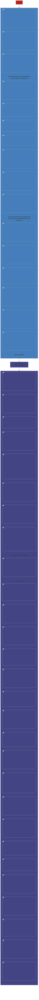

Both Primary Entity and Secondary Entity are the same

**Example** 
parent location - sub location

### Configuring Self Relationship

```mermaid

graph TB

0["steps"] --> 1
1["<div class = 'scrollmenu'><img src='http://127.0.0.1:8000/a8f2f674-533f-4392-a1c4-85ca1f0ab13b.png' width='373' height='268'/><br><br><img src='http://127.0.0.1:8000/44d05281-b757-4835-a045-d7ff977d0f0b.png' width='329' height='269'/><br><br><img src='http://127.0.0.1:8000/78436cc6-536b-42ea-9ae4-1bf2df17eaf4.png' width='356' height='268'/><br><br><b>you get this checkbox only when primary<br>entity is equal to related entity</b><br><br><img src='http://127.0.0.1:8000/db3559fa-9b59-4b0d-86ea-90e34d488ad2.png' width='233' height='267'/><br><br><img src='http://127.0.0.1:8000/f25936be-d372-40d0-8b30-f6ad9ed0f7e3.png' width='475' height='192'/><br><br><img src='http://127.0.0.1:8000/4f506358-05d4-4872-94f7-05818be3d7d1.png' width='475' height='165'/><br><br><img src='http://127.0.0.1:8000/70f1c0c3-3ffc-4b72-9134-5f0c86aca27f.png' width='477' height='157'/><br><br><img src='http://127.0.0.1:8000/abd2338f-62f4-4721-86a3-b42db622fe8f.png' width='234' height='269'/><br><br><img src='http://127.0.0.1:8000/9e02dd0d-a708-4e21-8ba3-b535cedb2273.png' width='444' height='268'/><br><br><img src='http://127.0.0.1:8000/5a81ad40-e890-475d-88cc-378e72640f1f.png' width='405' height='267'/><br><br><b>In this case both primary and related entity<br>are same so we can add both lookup and<br>subgrid here</b><br><br><img src='http://127.0.0.1:8000/0165dc53-a37c-4cb7-b663-e761cee54dae.png' width='246' height='269'/><br><br><img src='http://127.0.0.1:8000/7d111a44-7c51-41dd-86c1-dd6702bfd2b1.png' width='445' height='269'/><br><br><img src='http://127.0.0.1:8000/02a9f08b-a024-48cf-bb97-722f32ff04ae.png' width='478' height='233'/><br><br><img src='http://127.0.0.1:8000/9729b3d0-11c9-4b0c-883e-41ed0faf868c.png' width='479' height='268'/><br><br><img src='http://127.0.0.1:8000/45754fbe-40f6-465e-a14e-49b5ba525486.png' width='394' height='268'/><br><br><img src='http://127.0.0.1:8000/b477ce6f-5c58-4656-9f99-9d803e80ef70.png' width='394' height='268'/><br><br><b>Save and publish</b><br><br></div>"]
1 --> 2["configure sitemap to display the entity"]
2 --> 3["<div class = 'scrollmenu'><img src='http://127.0.0.1:8000/b240ad0e-0844-4d38-a226-6e5b41def9fc.png' width='366' height='268'/><br><br><img src='http://127.0.0.1:8000/158a39d0-4ae7-4066-9477-422a58b3a6e8.png' width='380' height='268'/><br><br><img src='http://127.0.0.1:8000/530d3392-9cea-4d7a-af00-ff3daf944fb6.png' width='478' height='166'/><br><br><img src='http://127.0.0.1:8000/9f9a1ecc-5fae-41bc-9197-6a8d102b1a07.png' width='474' height='269'/><br><br><img src='http://127.0.0.1:8000/9ceb5e5a-7ffb-4d94-8312-e3fa1035c1cb.png' width='389' height='359'/><br><br><img src='http://127.0.0.1:8000/5790fb4e-72cc-4c30-bf54-d05b68ba9cbf.png' width='404' height='269'/><br><br><img src='http://127.0.0.1:8000/cb29b1e7-0f8f-48f5-b9ae-79a880707d56.png' width='129' height='267'/><br><br><img src='http://127.0.0.1:8000/ab3d6d18-1aac-4e24-989a-58c2cfc67d1a.png' width='321' height='343'/><br><br><b>Press ctrl + F5 for hard refresh</b><br><br><img src='http://127.0.0.1:8000/943ec8b3-ca85-4526-a365-e32fd5646a3f.png' width='405' height='269'/><br><br><b>Create records</b><br><br><img src='http://127.0.0.1:8000/d808fad4-3163-499e-89f5-a06c06af3e99.png' width='477' height='246'/><br><br><img src='http://127.0.0.1:8000/882aeac3-8eab-42b7-b45e-4639b71aa565.png' width='456' height='267'/><br><br><img src='http://127.0.0.1:8000/c6c4e7bb-f18a-4593-ace2-45aed64c7ca1.png' width='477' height='265'/><br><br><img src='http://127.0.0.1:8000/e8fa3bd3-461a-4fdf-9fc5-aa7aed177596.png' width='475' height='241'/><br><br><img src='http://127.0.0.1:8000/5ae07fac-a69f-43f3-80bb-1194b0d97063.png' width='448' height='268'/><br><br><img src='http://127.0.0.1:8000/91225498-82a1-4a20-9dd6-242658350176.png' width='477' height='220'/><br><br><img src='http://127.0.0.1:8000/67310596-9f14-47b0-8039-ad9f61d1479b.png' width='403' height='268'/><br><br><img src='http://127.0.0.1:8000/d874029e-05fc-4f8f-88d8-0ad9d84220db.png' width='459' height='209'/><br><br><img src='http://127.0.0.1:8000/eb18f37a-fccb-491e-be48-9c5efbc6dff3.png' width='341' height='267'/><br><br><img src='http://127.0.0.1:8000/94753549-0bc9-43de-a634-9627038149b5.png' width='436' height='293'/><br><br><img src='http://127.0.0.1:8000/6ba8e6b6-b226-4af1-9b33-8c749caab8b6.png' width='217' height='268'/><br><br><img src='http://127.0.0.1:8000/16e1e49e-51af-4ce1-a7b3-5293e4ebb040.png' width='384' height='267'/><br><br><img src='http://127.0.0.1:8000/89b17913-313f-4d7f-872b-898c227ca152.png' width='479' height='204'/><br><br><img src='http://127.0.0.1:8000/1c244914-76c1-473e-891b-51e13a920554.png' width='476' height='176'/><br><br><img src='http://127.0.0.1:8000/9541f229-55c8-4d5d-b933-a81143e92aec.png' width='441' height='269'/><br><br><img src='http://127.0.0.1:8000/b80e94d8-7fe6-445d-ab94-1b30f573d42b.png' width='344' height='268'/><br><br><img src='http://127.0.0.1:8000/9fbc7442-a9c3-42b2-9ccd-33eca77924b2.png' width='478' height='246'/><br><br><img src='http://127.0.0.1:8000/b1209946-d731-46e0-89c7-0a3898d8f1a1.png' width='457' height='267'/><br><br><img src='http://127.0.0.1:8000/ed9a9932-e169-490e-a665-733b81e6a35d.png' width='421' height='267'/><br><br></div>"]

style 0 fill:#ba271b
style 1 fill:#457eba
style 2 fill:#434483
style 3 fill:#434483

```

