Customize components like
- Entities
- Security roles
- Settings

>We get a physical file with customized components for export

### Exports type
- **Managed** - intended to be distributed and installed
- **Unmanaged** - still under development

### Publisher
helps in prefixing generally with the profile of the company owning the solution

>must to create a solution

### Creating a solution

```mermaid

graph TB

0["Creating a publisher"] --> 1
1["<div class = 'scrollmenu'><img src='./md_assets/attachments/79518561-f48d-4246-8acf-08025d20708e.png' width='310' height='251'/><br><br><img src='./md_assets/attachments/4c451238-d3bc-4051-a381-fb39705ec9c1.png' width='345' height='376'/><br><br><img src='./md_assets/attachments/a037bbe1-3896-4295-82b9-6cbf9e40ae62.png' width='576' height='375'/><br><br><img src='./md_assets/attachments/9468c4b1-a5b3-4587-807f-191a008e4345.png' width='583' height='375'/><br><br><b>Creating an entity say &quot;company&quot; will<br>get prefixed as &quot;prefix_company&quot;</b><br><br><img src='./md_assets/attachments/dd7a55a5-5686-4a40-9651-9c4cf321403e.png' width='413' height='377'/><br><br><img src='./md_assets/attachments/b114fe25-bd5b-4f6d-b60e-e46f1a0d3c0b.png' width='166' height='375'/><br><br><img src='./md_assets/attachments/6ad304c9-410f-462b-b77f-24d6320f5956.png' width='571' height='377'/><br><br><img src='./md_assets/attachments/Pasted%20image%2020221222194659.png' width='1033' height='376'/><br><br></div>"]
1 --> 2["Add existing components"]
2 --> 3["<div class = 'scrollmenu'><img src='./md_assets/attachments/036698a5-4089-4075-b2fa-df7d002c5489.png' width='517' height='284'/><br><br><img src='./md_assets/attachments/1c29c31d-4161-4a66-b645-da67b8561a79.png' width='702' height='369'/><br><br><img src='./md_assets/attachments/fb61316b-6326-401a-9e34-021033affc6d.png' width='691' height='298'/><br><br><img src='./md_assets/attachments/47c07558-d120-4026-92bf-fbfd8edc79e3.png' width='671' height='377'/><br><br><img src='./md_assets/attachments/c4115acb-5368-46b8-b327-dd62274391c5.png' width='780' height='294'/><br><br><img src='./md_assets/attachments/fdedfc06-672f-4456-b8e0-2e79ba722d21.png' width='1151' height='316'/><br><br><img src='./md_assets/attachments/5913bd12-fce5-4a7f-946d-ede4ae3bfcc7.png' width='532' height='338'/><br><br><img src='./md_assets/attachments/c22eba94-93c8-48ea-9531-106811166660.png' width='1147' height='259'/><br><br></div>"]

style 0 fill:#ba271b
style 1 fill:#457eba
style 2 fill:#434483
style 3 fill:#434483

```

