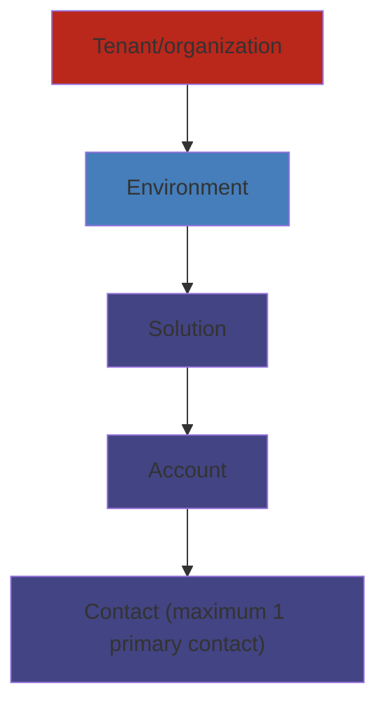

```mermaid

graph TB

0["Tenant/organization"] --> 1
1["Environment"]
1 --> 2["Solution"]
2 --> 3["Account"]
3 --> 4["Contact (maximum 1 primary contact)"]

style 0 fill:#ba271b
style 1 fill:#457eba
style 2 fill:#434483
style 3 fill:#434483
style 4 fill:#434483

```
