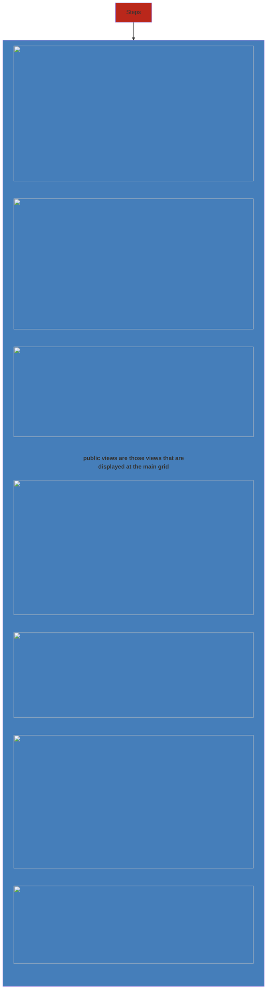

Filter entities for specific columns or records
**Example** - My Open Opportunities, All Opportunities, Closed Opportunities

### Types
- **Personal**
- **System** - Public or Non-public

### Configuring Views

