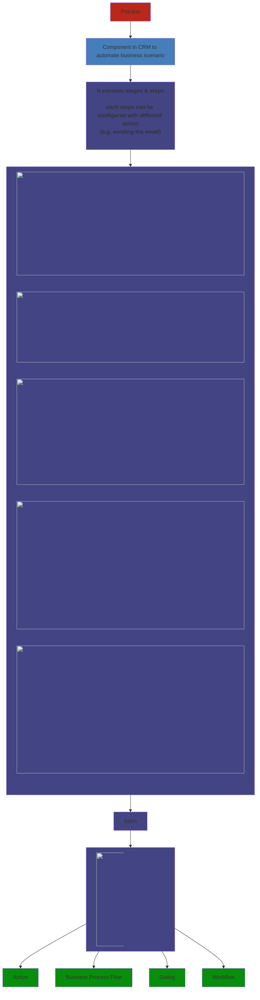
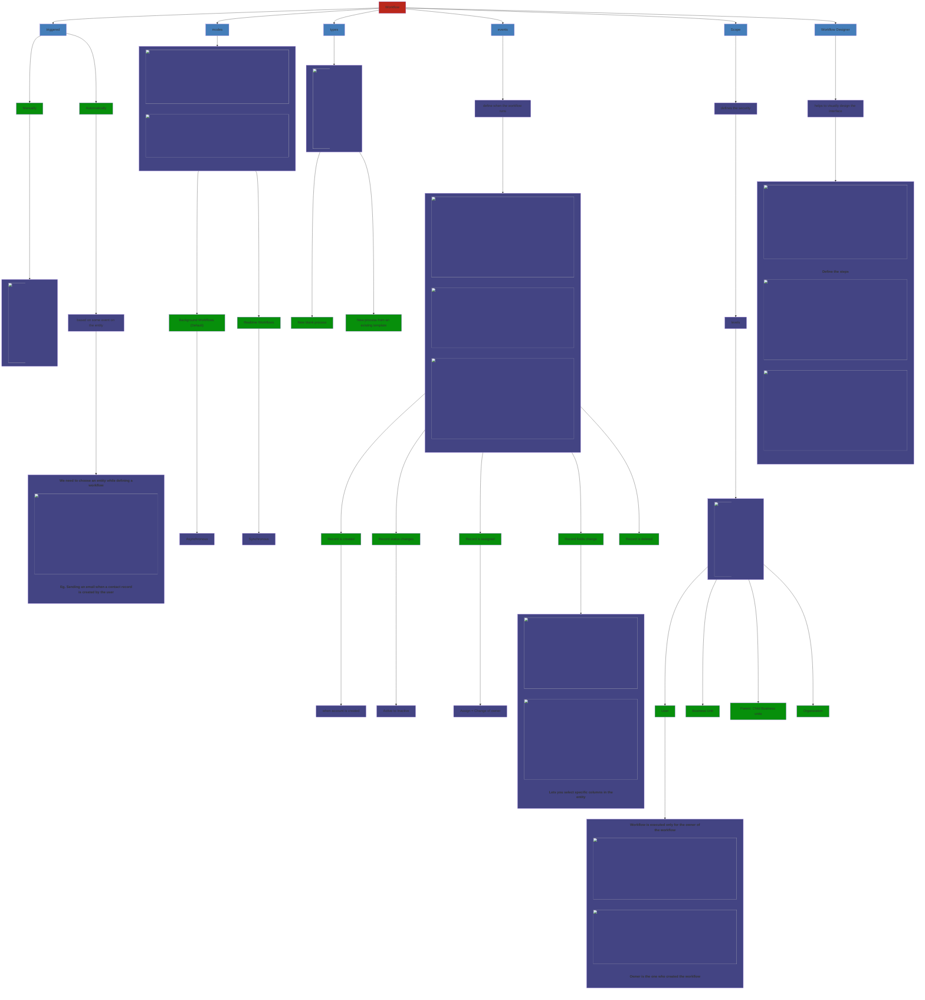

```mermaid

graph TB

0["Process"] --> 1
1["Component in CRM to automate business scenario"]
1 --> 2["<div class = 'scrollmenu'><b>It consists stages & steps</b><br><br><b>each steps can be configured with different action<br>(e.g. sending the email)</b><br><br></div>"]
2 --> 3["<div class = 'scrollmenu'><img src='https://bjcjckb78kjbckje893y83rbbcoub3896ebocoub3.vercel.app/md_assets/attachments/66039d85-9969-48c9-8f55-86950446bf97.png' width='667' height='303'/><br><br><img src='https://bjcjckb78kjbckje893y83rbbcoub3896ebocoub3.vercel.app/md_assets/attachments/d7cc8f84-f81f-44c4-963d-9cdf413f9312.png' width='668' height='207'/><br><br><img src='https://bjcjckb78kjbckje893y83rbbcoub3896ebocoub3.vercel.app/md_assets/attachments/5e925e4e-ff18-41b7-b86d-68031e9f5093.png' width='667' height='310'/><br><br><img src='https://bjcjckb78kjbckje893y83rbbcoub3896ebocoub3.vercel.app/md_assets/attachments/4550af61-4f28-4cb2-8e27-acf0de8f7cb0.png' width='574' height='375'/><br><br><img src='https://bjcjckb78kjbckje893y83rbbcoub3896ebocoub3.vercel.app/md_assets/attachments/7e9e409c-b8a0-45d1-8903-fd292a65cf21.png' width='503' height='374'/><br><br></div>"]
3 --> 4["types"]
4 --> 5["<img src='https://bjcjckb78kjbckje893y83rbbcoub3896ebocoub3.vercel.app/md_assets/attachments/1af80a1d-aecd-40b8-8f24-3d107a0b640b.png' width='669' height='274'/>"]
5 --> 6["<p>Action</p>"]
5 --> 7["<p>Business Process Flow</p>"]
5 --> 8["<p>Dialog</p>"]
5 --> 9["<p>Workflow</p>"]

style 0 fill:#ba271b
style 1 fill:#457eba
style 2 fill:#434483
style 3 fill:#434483
style 4 fill:#434483
style 5 fill:#434483
style 6 fill:#078f0b
style 7 fill:#078f0b
style 8 fill:#078f0b
style 9 fill:#078f0b

```

- [ ] 

___

```mermaid

graph TB

0["Workflow"] --> 1
1["triggered"]
1 --> 2["<p>Manually</p>"]
2 --> 3["<img src='https://bjcjckb78kjbckje893y83rbbcoub3896ebocoub3.vercel.app/md_assets/attachments/ad3e6d6b-34a1-4f59-9d2d-fd047415974a.png' width='469' height='374'/>"]
1 --> 4["<p>Automatically</p>"]
4 --> 5["based on some event on the entity"]
5 --> 6["<div class = 'scrollmenu'><b>We need to choose an entity while defining a<br>workflow</b><br><br><img src='https://bjcjckb78kjbckje893y83rbbcoub3896ebocoub3.vercel.app/md_assets/attachments/480e2b06-9998-42f0-b68c-378b13db6c9b.png' width='575' height='377'/><br><br><b>Eg. Sending an email when a contact record<br>is created by the user</b><br><br></div>"]
0["Workflow"] --> 7
7["modes"]
7 --> 8["<div class = 'scrollmenu'><img src='https://bjcjckb78kjbckje893y83rbbcoub3896ebocoub3.vercel.app/md_assets/attachments/8740dc64-c066-4db2-87ea-a079d695bda2.png' width='668' height='253'/><br><br><img src='https://bjcjckb78kjbckje893y83rbbcoub3896ebocoub3.vercel.app/md_assets/attachments/0a700b7e-7ef8-4c99-a9fb-fa2ff93063a9.png' width='669' height='201'/><br><br></div>"]
8 --> 9["<p>Background Workflows (Default)</p>"]
9 --> 10["Asynchronous"]
8 --> 11["<p>Realtime Workflows</p>"]
11 --> 12["Synchronous"]
0["Workflow"] --> 13
13["types"]
13 --> 14["<img src='https://bjcjckb78kjbckje893y83rbbcoub3896ebocoub3.vercel.app/md_assets/attachments/c41171d3-3e49-428f-97bc-22f2c65c966a.png' width='505' height='374'/>"]
14 --> 15["<p>New blank process</p>"]
14 --> 16["<p>New process from an existing template</p>"]
0["Workflow"] --> 17
17["events"]
17 --> 18["define when the workflow runs"]
18 --> 19["<div class = 'scrollmenu'><img src='https://bjcjckb78kjbckje893y83rbbcoub3896ebocoub3.vercel.app/md_assets/attachments/7a054ec1-ac39-4eb6-9a61-c017cd4d29ed.png' width='503' height='377'/><br><br><img src='https://bjcjckb78kjbckje893y83rbbcoub3896ebocoub3.vercel.app/md_assets/attachments/b84d4cb6-6dc3-46c2-bad9-e039ef2c92ae.png' width='665' height='280'/><br><br><img src='https://bjcjckb78kjbckje893y83rbbcoub3896ebocoub3.vercel.app/md_assets/attachments/dd8c2afd-4d23-4229-b04c-336c7e8cb0c9.png' width='660' height='376'/><br><br></div>"]
19 --> 20["<p>Record is created</p>"]
20 --> 21["when account is created"]
19 --> 22["<p>Record status changes</p>"]
22 --> 23["Active to Inactive"]
19 --> 24["<p>Record is assigned</p>"]
24 --> 25["Assign = Change of owner"]
19 --> 26["<p>Record fields change</p>"]
26 --> 27["<div class = 'scrollmenu'><img src='https://bjcjckb78kjbckje893y83rbbcoub3896ebocoub3.vercel.app/md_assets/attachments/1b30c9e7-814b-4c28-bb4b-a1c9b952b794.png' width='530' height='333'/><br><br><img src='https://bjcjckb78kjbckje893y83rbbcoub3896ebocoub3.vercel.app/md_assets/attachments/8ed39488-2d41-4b27-98ec-b44ca9a9e9ec.png' width='468' height='374'/><br><br><b>Lets you select specific columns in the<br>entity</b><br><br></div>"]
19 --> 28["<p>Record is deleted</p>"]
0["Workflow"] --> 29
29["Scope"]
29 --> 30["defines the security"]
30 --> 31["levels"]
31 --> 32["<img src='https://bjcjckb78kjbckje893y83rbbcoub3896ebocoub3.vercel.app/md_assets/attachments/8a84508b-94e8-4ab4-b4db-44d1c7617bbf.png' width='524' height='347'/>"]
32 --> 33["<p>User</p>"]
33 --> 34["<div class = 'scrollmenu'><b>Workflow is executed only for the owner of<br>the workflow</b><br><br><img src='https://bjcjckb78kjbckje893y83rbbcoub3896ebocoub3.vercel.app/md_assets/attachments/f3fdd765-2bc4-4f72-8eff-cab5e8a74195.png' width='667' height='287'/><br><br><img src='https://bjcjckb78kjbckje893y83rbbcoub3896ebocoub3.vercel.app/md_assets/attachments/b419ecc9-3395-48f9-9d23-1dfdc862dca1.png' width='670' height='253'/><br><br><b>Owner is the one who created the workflow</b><br><br></div>"]
32 --> 35["<p>Business Unit</p>"]
32 --> 36["<p>Parent: Child Business units</p>"]
32 --> 37["<p>Organization</p>"]
0["Workflow"] --> 38
38["Workflow Designer"]
38 --> 39["helps to visually design the interface"]
39 --> 40["<div class = 'scrollmenu'><img src='https://bjcjckb78kjbckje893y83rbbcoub3896ebocoub3.vercel.app/md_assets/attachments/aec40504-05df-4778-8e12-080bce02f39d.png' width='670' height='345'/><br><br><b>Define the steps</b><br><br><img src='https://bjcjckb78kjbckje893y83rbbcoub3896ebocoub3.vercel.app/md_assets/attachments/4d95185d-fff9-4368-8751-a0cb9b995a11.png' width='394' height='375'/><br><br><img src='https://bjcjckb78kjbckje893y83rbbcoub3896ebocoub3.vercel.app/md_assets/attachments/bb866b39-93c5-463c-80da-2f5c398c7e1e.png' width='659' height='374'/><br><br></div>"]

style 0 fill:#ba271b
style 1 fill:#457eba
style 2 fill:#078f0b
style 3 fill:#434483
style 4 fill:#078f0b
style 5 fill:#434483
style 6 fill:#434483
style 7 fill:#457eba
style 8 fill:#434483
style 9 fill:#078f0b
style 10 fill:#434483
style 11 fill:#078f0b
style 12 fill:#434483
style 13 fill:#457eba
style 14 fill:#434483
style 15 fill:#078f0b
style 16 fill:#078f0b
style 17 fill:#457eba
style 18 fill:#434483
style 19 fill:#434483
style 20 fill:#078f0b
style 21 fill:#434483
style 22 fill:#078f0b
style 23 fill:#434483
style 24 fill:#078f0b
style 25 fill:#434483
style 26 fill:#078f0b
style 27 fill:#434483
style 28 fill:#078f0b
style 29 fill:#457eba
style 30 fill:#434483
style 31 fill:#434483
style 32 fill:#434483
style 33 fill:#078f0b
style 34 fill:#434483
style 35 fill:#078f0b
style 36 fill:#078f0b
style 37 fill:#078f0b
style 38 fill:#457eba
style 39 fill:#434483
style 40 fill:#434483

```

- [ ] 

___

```mermaid

graph TB

0["Workflow Example"] --> 1
1["Scenario : When account is created, verification<br>. create a task for the owner of the record<br>to start"]
1 --> 2["<div class = 'scrollmenu'><b>Here task is an entity</b><br><br><img src='https://bjcjckb78kjbckje893y83rbbcoub3896ebocoub3.vercel.app/md_assets/attachments/024c1831-1cda-4fa4-8732-792bf4ce2a71.png' width='668' height='221'/><br><br><img src='https://bjcjckb78kjbckje893y83rbbcoub3896ebocoub3.vercel.app/md_assets/attachments/bc87071e-1eb3-411c-a023-ee4418ff9860.png' width='468' height='374'/><br><br><img src='https://bjcjckb78kjbckje893y83rbbcoub3896ebocoub3.vercel.app/md_assets/attachments/5ad76fd1-1218-4b5d-8268-7764e7a7482a.png' width='395' height='375'/><br><br><img src='https://bjcjckb78kjbckje893y83rbbcoub3896ebocoub3.vercel.app/md_assets/attachments/2dfe4d61-e9e4-41e0-88cd-1cf91f4a21ca.png' width='618' height='328'/><br><br><img src='https://bjcjckb78kjbckje893y83rbbcoub3896ebocoub3.vercel.app/md_assets/attachments/3933471d-7ea5-4572-99e3-e39e4bdf30b8.png' width='667' height='319'/><br><br><b>Assume that the Task has to be completed within<br>3 days of creating the account</b><br><br><b>Since the due date is dynamically selected in<br>future we use Form Assistant</b><br><br><img src='https://bjcjckb78kjbckje893y83rbbcoub3896ebocoub3.vercel.app/md_assets/attachments/9f4a0d3e-9ff8-45b7-bb99-fde9625f1758.png' width='406' height='375'/><br><br><img src='https://bjcjckb78kjbckje893y83rbbcoub3896ebocoub3.vercel.app/md_assets/attachments/3ce97409-7b8c-43f0-964b-f46245ff4b7d.png' width='323' height='377'/><br><br><img src='https://bjcjckb78kjbckje893y83rbbcoub3896ebocoub3.vercel.app/md_assets/attachments/1844d17d-9707-4188-9e77-06e6e434f1d5.png' width='642' height='374'/><br><br><b>use need to activate the workflow to run<br>it</b><br><br><img src='https://bjcjckb78kjbckje893y83rbbcoub3896ebocoub3.vercel.app/md_assets/attachments/b5de23a1-0367-430f-8eae-1a1548243452.png' width='670' height='307'/><br><br><img src='https://bjcjckb78kjbckje893y83rbbcoub3896ebocoub3.vercel.app/md_assets/attachments/f2a14a4b-186c-4c3e-9296-c1ddc1a7e30a.png' width='666' height='325'/><br><br><img src='https://bjcjckb78kjbckje893y83rbbcoub3896ebocoub3.vercel.app/md_assets/attachments/d695e838-2630-4649-ad35-a45cfb31097b.png' width='668' height='353'/><br><br><img src='https://bjcjckb78kjbckje893y83rbbcoub3896ebocoub3.vercel.app/md_assets/attachments/0725d754-dc84-4093-bb87-bc17d2ce7754.png' width='666' height='133'/><br><br></div>"]
2 --> 3["Create new Account"]
3 --> 4["<div class = 'scrollmenu'><img src='https://bjcjckb78kjbckje893y83rbbcoub3896ebocoub3.vercel.app/md_assets/attachments/30406c71-fb12-4520-aa20-52e9d4552b9e.png' width='668' height='319'/><br><br><img src='https://bjcjckb78kjbckje893y83rbbcoub3896ebocoub3.vercel.app/md_assets/attachments/494b5f64-7e30-4c89-bddf-b6c279197910.png' width='413' height='377'/><br><br><img src='https://bjcjckb78kjbckje893y83rbbcoub3896ebocoub3.vercel.app/md_assets/attachments/075f1bf7-ad7b-46c3-894b-7706c4bd31a9.png' width='241' height='377'/><br><br><img src='https://bjcjckb78kjbckje893y83rbbcoub3896ebocoub3.vercel.app/md_assets/attachments/52cd53e8-3c15-4c78-80c8-cb9dc5df0de7.png' width='671' height='260'/><br><br><img src='https://bjcjckb78kjbckje893y83rbbcoub3896ebocoub3.vercel.app/md_assets/attachments/7d916f99-8176-405c-a0c2-e0c06af9ed7f.png' width='490' height='374'/><br><br><b>You may need to refresh as background workflow<br>is asynchronous in nature</b><br><br><img src='https://bjcjckb78kjbckje893y83rbbcoub3896ebocoub3.vercel.app/md_assets/attachments/bfac2be9-8cef-469b-ab50-1d5e7e577b82.png' width='499' height='376'/><br><br><img src='https://bjcjckb78kjbckje893y83rbbcoub3896ebocoub3.vercel.app/md_assets/attachments/430dbf26-1267-4ac4-b07f-787776647be8.png' width='655' height='376'/><br><br><b>Here you can close task</b><br><br><b>mark it as completed or assign it to other<br>user</b><br><br><img src='https://bjcjckb78kjbckje893y83rbbcoub3896ebocoub3.vercel.app/md_assets/attachments/a134cbcc-0f6e-4d53-963b-462652d51996.png' width='668' height='164'/><br><br><img src='https://bjcjckb78kjbckje893y83rbbcoub3896ebocoub3.vercel.app/md_assets/attachments/cce636ee-7437-4b47-9c67-8f5ddbc4ca19.png' width='667' height='269'/><br><br><b>Task was marked as completed</b><br><br><img src='https://bjcjckb78kjbckje893y83rbbcoub3896ebocoub3.vercel.app/md_assets/attachments/38a706b9-e69d-4d56-a844-6afaf229dd4e.png' width='543' height='375'/><br><br></div>"]

style 0 fill:#ba271b
style 1 fill:#457eba
style 2 fill:#434483
style 3 fill:#434483
style 4 fill:#434483

```

- [ ] 

___
